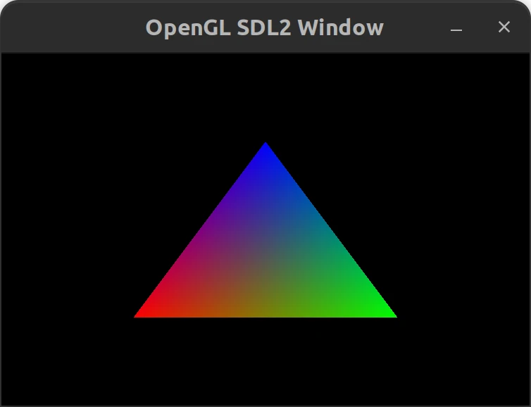

# opengl_sdl2_window



## About
A simple OpenGL window with SDL2 written in C++

## Dependencies
* gcc (GNU GCC Compiler)
	* build-essential (Debian and Ubuntu distros and its derivatives)
* libsdl2-dev
* libsdl2-mixer-dev
* libsld2-image-dev
* cmake

## Manual Install (Ubuntu 22.04.2 LTS)
[manual_install_sdl2](./manual_install_sdl2.md)

## Building the project
Go the root of my repository
```
cd opengl_sdl2_window
```

Set up the build directory
```
cmake -B build
```

Go to build directory
```
cd build
```

Compile the project
```
cmake --build .
```

